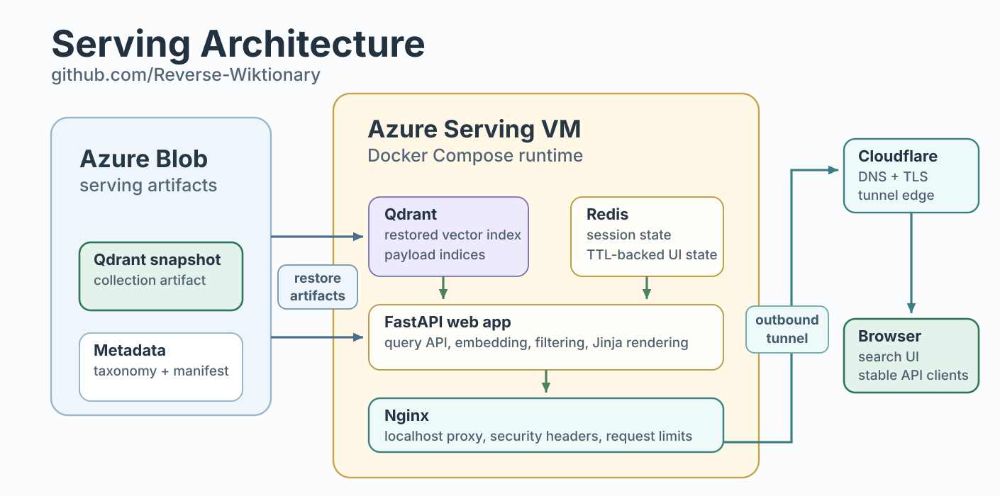

# Web Serving Design

The web service serves natural-language reverse dictionary queries against a
Qdrant snapshot produced by
[Reverse-Wiktionary-Offline](https://github.com/itincknell/Reverse-Wiktionary-Offline).

## Architecture

The serving layer is intentionally narrow. Expensive artifact production happens
offline; this repo restores those artifacts and serves requests through a
private-by-default web stack on a single Azure VM.

- Artifact boundary: Azure Blob Storage is the handoff contract from the
  offline pipeline. The serving inputs are a Qdrant snapshot, taxonomy metadata,
  serving metadata, and manifests.
- Runtime boundary: Docker Compose colocates Qdrant, Redis, FastAPI/Uvicorn,
  and Nginx. Qdrant serves vector retrieval, Redis stores UI session state,
  FastAPI owns the API/templates, and Nginx is the local HTTP edge.
- Exposure boundary: Cloudflare Tunnel publishes Nginx only. Qdrant, Redis, and
  FastAPI are not public surfaces.

<p align="center">――――――――――</p>

<p align="center">
  
</p>

<p align="center"><em>Beta serving deployment: immutable artifacts, private runtime services, and a Cloudflare-backed public edge.</em></p>

This repository does not own preprocessing, embedding generation, taxonomy
construction, or snapshot creation. Those responsibilities stay in the offline
pipeline. The serving repo restores or connects to existing artifacts and owns
the request path from query validation through result rendering.

Runtime services run under Docker Compose on a single Azure Linux VM. The
application container serves both the HTML UI and the stable API through
FastAPI/Uvicorn. Qdrant serves the restored vector collection, Redis stores
short-lived UI session state, Nginx terminates local HTTP for the Compose stack,
and Cloudflare Tunnel provides the outbound-only public edge.

The serving repo treats the restored Qdrant snapshot and taxonomy metadata as
immutable deployment inputs. Runtime code is responsible for validation, request
handling, filtering, rendering, and operational checks; it does not mutate the
restored collection or rebuild taxonomy.

## Source Layout

```text
src/search/        Qdrant query client and search orchestration.
src/web/           FastAPI app, templates, static assets, session state.
deploy/web/        Web Dockerfile, Compose files, Nginx config.
scripts/web/       Deploy, health check, smoke, and benchmark scripts.
scripts/azure/     VM bootstrap and remote web smoke entrypoints.
scripts/qdrant/    Serving-side Qdrant verification/tuning helpers.
```

## Network Boundary

The production Compose stack is private by default. Qdrant, Redis, and FastAPI
are reachable only on Docker-internal networking. Nginx binds to
`127.0.0.1:8080` for local health checks and private operator access. Public
traffic uses Cloudflare Tunnel, which makes an outbound connection from the VM
and does not require inbound VM rules for ports 80 or 443.

Nginx applies a small request body limit, proxy timeouts, security headers, and
modest request limiting keyed by `CF-Connecting-IP` when Cloudflare supplies it.

## Stable API

```text
POST /api/v1/search
```

Request:

```json
{
  "query": "a book listing words and their meanings",
  "langs": [],
  "pos": [],
  "limit": 25,
  "offset": 0
}
```

Response:

```json
{
  "query": "a book listing words and their meanings",
  "filters": {
    "langs": [],
    "pos": []
  },
  "limit": 25,
  "offset": 0,
  "has_more": true,
  "timing_ms": {
    "embedding": 12.4,
    "qdrant": 31.8,
    "total": 47.2
  },
  "results": [
    {
      "word": "dictionary",
      "lang": "English",
      "pos": "noun",
      "score": 0.82,
      "glosses": ["A reference work listing words..."],
      "expansion": null,
      "wiktionary_url": "https://en.wiktionary.org/wiki/dictionary#English"
    }
  ]
}
```

Validation:

- `query`: required, trimmed, bounded string.
- `langs`: optional list; empty means all languages.
- `pos`: optional list; empty means all parts of speech.
- `limit`: default 25, max 100.
- `offset`: default 0, non-negative.

Filter semantics:

- Multiple languages are ORed.
- Multiple POS values are ORed.
- Language and POS filter groups are ANDed together.
- Repeated values are normalized and deduplicated.
- Results are returned in Qdrant score order without application-side reranking.

## Web Routes

```text
GET  /
GET  /about
POST /ui/search
POST /ui/search/more
GET  /health
```

`/ui/*` routes are implementation routes for the HTMX/Jinja UI. The stable
programmatic contract is `/api/v1/search`.

## Query Path

```text
request
  -> validate query/limit/offset/filters
  -> encode query text
  -> build Qdrant filter
  -> search Qdrant
  -> normalize response payloads
  -> return JSON or render HTML partial
```

Search logs include aggregate timings without recording raw query text:

```text
embedding_ms
qdrant_ms
search_total_ms
route_overhead_ms
route_total_ms
result_count
filter counts
```

Each FastAPI worker owns its model instance, Qdrant client, Redis client, and
search service objects. There is no central query queue between web workers and
Qdrant.

Qdrant searches use configurable query-time `hnsw_ef`. Searches with language
or POS filters enable Qdrant ACORN traversal with `max_selectivity=1.0`.
Payload indexes are part of the serving snapshot.

For diagnostics, `SEARCH_EXACT_FILTERED=true` switches filtered requests to
exact Qdrant search.

The web service uses the same embedding model and vector dimension as the
serving snapshot.

## User Interface

UI stack:

```text
FastAPI
Jinja2
HTMX
plain CSS and JavaScript
```

UI behavior:

```text
default languages: all
default POS: all
initial page: no results
search execution: explicit Search button only
pagination: Load more button
gloss display: first three glosses, show-more toggle for the rest
expansion display: hidden by default, toggle when present
```

The language selector consumes the offline-produced taxonomy artifact when
available and falls back to a flat Qdrant language facet list when the artifact
is absent. The visible browse tree may omit low-value singleton family paths;
the flat `all_languages` list powers search-only matches, select-all, and
submitted filter allowlists.

Result cards link to English Wiktionary pages. Links are computed locally from
the lean payload fields `word` and `lang`; the serving path does not call
Wiktionary or store duplicate URL fields in Qdrant.

## Session State

Redis stores per-client UI state across multiple FastAPI workers.

```text
key: rw:session:<session_uuid>
ttl: 86400 seconds
```

Stored fields:

```text
selected_langs
selected_pos
latest_query
limit
next_offset
created_at_utc
updated_at_utc
```

Result bodies are not stored in Redis. "Load more" reruns the latest
query/filter state with the next offset.

## Deployment

Serving target:

```text
single Azure Linux VM
Docker Compose
Qdrant container
Redis container
FastAPI/web container
Nginx reverse proxy
OS disk for durable Qdrant storage
```

The web image can be built once and loaded from a Docker archive on small beta
hosts. This keeps the PyTorch/model dependency build off the deployment VM while
still allowing Git-based source control for configuration and templates.

Initial FastAPI worker count:

```text
1 sync worker on 2-vCPU beta hosts
```

Worker count is a hardware and memory tuning decision because each worker loads
its own model copy.

Production host paths:

```text
/opt/reverse-wiktionary/app
/opt/reverse-wiktionary/data/qdrant/storage
/opt/reverse-wiktionary/data/redis/data
/opt/reverse-wiktionary/data/logs
/opt/reverse-wiktionary/data/snapshots
/opt/reverse-wiktionary/data/restore
```

Production Qdrant storage lives outside the application repository and outside
the Azure temporary disk.

## Restore Flow

```text
read indexes/latest.json
download indexes/<run_id>/manifest.json
download snapshot from indexes/<run_id>/snapshots/
restore Qdrant collection
verify lang and pos payload indexes
stage processed/latest language taxonomy and serving metadata
delete downloaded snapshot when restore is complete
start web service
verify /health
```

## Operational Validation

Serving latency testing uses `scripts/web/benchmark_search.py` with a fixed
query set in `scripts/web/benchmark_queries.json`. The harness exercises API and
UI routes separately and reports latency percentiles, throughput, errors, and
API search timing fields. It can also write per-request samples for later
review.

Remote smoke runs upload benchmark artifacts and the web log to:

```text
logs/web_smoke/<run_id>/benchmark.json
logs/web_smoke/<run_id>/benchmark_samples.json
logs/web_smoke/<run_id>/web.log
```

## Capacity Notes

May 2026 live tests on the 768-dimensional mpnet collection showed:

```text
Qdrant version: 1.18.0
points: 3,869,247
filtered quality fix: ACORN enabled
quantization: scalar int8, original vectors on disk
```

On an 8 GiB `Standard_B2ms` host, Qdrant fit in memory but fresh searches were
sometimes slow. `vmstat` during a 7s query showed high iowait, which points to
disk/page-cache pressure rather than Python/model CPU.

Current low-cost beta target:

```text
region: northcentralus
vm: Standard_B2as_v2
cpu/ram: 2 burstable vCPU / 8 GiB
disk: 64 GiB Standard SSD OS disk
estimated cost: about $60/mo
```

The current v3 artifact set uses 768-dimensional vectors with scalar int8
quantization before snapshotting. A 512-dimensional beta artifact reduced
memory pressure but did not meet filtered retrieval quality requirements.

Committed run summaries:

```text
runs/web_serving/20260518-acorn-sizing.md
runs/web_serving/20260518-quantized-sizing.md
```

## Health Checks

`GET /health` reports:

```json
{
  "status": "ok",
  "qdrant": "ok",
  "redis": "ok",
  "collection": "reverse_wiktionary_v3",
  "model": "loaded",
  "vector_size": 768,
  "available_langs": 4663,
  "available_pos": 9,
  "language_taxonomy_families": 163,
  "qdrant_hnsw_ef": 512,
  "qdrant_acorn_max_selectivity": 1.0,
  "search_exact_filtered": false
}
```

The endpoint returns non-200 when Qdrant, Redis, model loading, or the
collection check fails.
